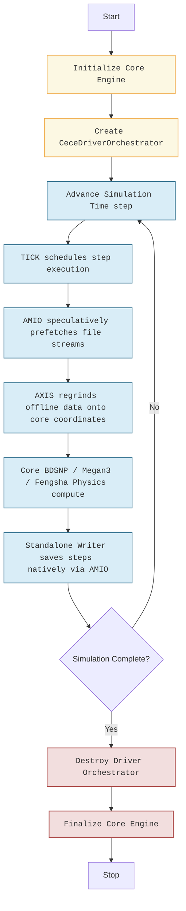

# Technical Architecture Report: CECE Core & Driver Compilation Split

**Status:** Completed & Fully Verified
**Date:** June 30, 2026
**Target Architecture:** CCPP-ready modular physics core coupled via a lean C-linkage facade

---

## 1. Executive Summary

Historically, the Chemical Emissions Coupling Environment (CECE) bound its spatial regridding, parallel file I/O, and data ingestion logic directly inside its physics and chemistry core. While highly integrated, this monolithic approach violated **Common Community Physics Package (CCPP)** readiness principles, as the physics kernels were heavily polluted with file-system, interpolation, and external scheduling dependencies.

This architecture split physically reorganizes and decouples the codebase into two distinct, standalone targets:
1.  **`libcece_core.so`**: A pure, lightweight physics and chemical speciation engine that has **zero** dependencies on file I/O, regridding, or scheduling frameworks. It is fully compliant with CCPP conventions and operates entirely on in-memory Kokkos device views.
2.  **`libcece_driver.so`**: The high-performance orchestration and offline ingestion engine. It encapsulates all heavy lifting (parallel NetCDF/Zarr reads via **AMIO**, coordinate transformation via **AXIS**, dependency graphing via **DAGR**, and scheduling via **TICK**), transforming raw disk streams into structured memory buffers for the core.

---

## 2. Directory & Target Reorganization

To enforce compile-time physical isolation and prevent accidental header or symbol leakage, the codebase has been structured into separate subdirectories under `src/`:

```text
src/
├── core/                               <-- Pure Compute & Physics Layer (libcece_core.so)
│   ├── physics/                        <-- Physical Schemes (BDSNP, Megan3, Fengsha, Ginoux)
│   │   ├── bdsnp_kernel.F90
│   │   ├── cece_bdsnp.cpp
│   │   ├── cece_canopy_model.cpp
│   │   ├── cece_dms.cpp
│   │   ├── cece_dust.cpp
│   │   ├── cece_emission_activity.cpp
│   │   ├── cece_fengsha.F90
│   │   ├── cece_fengsha.cpp
│   │   ├── cece_ginoux.cpp
│   │   ├── cece_k14.cpp
│   │   ├── cece_lightning.cpp
│   │   ├── cece_megan.cpp
│   │   ├── cece_megan3.cpp
│   │   ├── cece_native_example.cpp
│   │   ├── cece_soil_nox.cpp
│   │   ├── cece_speciation_config.cpp
│   │   ├── cece_speciation_engine.cpp
│   │   ├── cece_volcano.cpp
│   │   └── (corresponding Fortran-to-C++ bridges)
│   ├── cece_clock.cpp
│   ├── cece_config_parser.cpp
│   ├── cece_config_path.cpp
│   ├── cece_config_validator.cpp
│   ├── cece_core_field_helpers.cpp
│   ├── cece_core_finalize.cpp
│   ├── cece_core_initialize_p1.cpp     <-- Core init (completely independent of TIDE/AMIO)
│   ├── cece_core_initialize_p2.cpp     <-- Ingestor & grid coordinate registrations
│   ├── cece_core_realize.cpp
│   ├── cece_core_run.cpp
│   ├── cece_data_ingestor.cpp
│   ├── cece_diagnostic_manager.cpp
│   ├── cece_physics_factory.cpp
│   ├── cece_provenance.cpp
│   ├── cece_stacking_engine.cpp
│   ├── cece_standalone_writer.cpp
│   └── cece_c_api.cpp                  <-- Pure core C-linkage APIs
│
├── driver/                             <-- Orchestration & Ingestion Layer (libcece_driver.so)
│   ├── cece_helm_graph.cpp             <-- DAGR stream configuration compilation
│   ├── cece_regridder_utils.cpp         <-- AXIS coordinate transformation stencils
│   └── cece_driver_facade.cpp          <-- CeceDriverOrchestrator C++ class & C APIs
│
└── main.cpp                            <-- Standalone executable driving cece_driver & cece_core
```

---

## 3. The `CeceDriverOrchestrator` Ingestion & Driving Pipeline

The heavy manual loops that formerly occupied `src/main.cpp` and `standalone_nuopc/driver.F90` are now unified inside the `CeceDriverOrchestrator` C++ facade.

Both the standalone C++ execution and the coupled Fortran NUOPC cap utilize the exact same C-linkage entry points, guaranteeing absolute behavioral, numerical, and operational parity.

### 3.1 C-Linkage Interface Declarations
```cpp
extern "C" {
// 1. Instantiate the orchestrator with target grid coordinates & config file
void cece_driver_create(const char* yaml_path, int path_len,
                        int nx, int ny, int nz,
                        const double* lon_coords, const double* lat_coords,
                        void** driver_ptr_out, int* rc);

// 2. Perform background prefetching, parallel disk I/O, and AXIS spatial regridding
void cece_driver_advance_time(void* driver_ptr,
                              const char* time_iso8601, int time_len,
                              void* cece_core_data_ptr, int* rc);

// 3. Destruct the driver memory and release file handles asynchronously
void cece_driver_destroy(void* driver_ptr);
}
```

### 3.2 Unified Ingestion Pipeline Workflow
The workflow of driving `cece_core` is fully automated by the HELM micro-libraries under the hood:



---

## 4. Key Benefits & Verification Evidence

### 4.1 Compile-Time Physics Isolation (CCPP Readiness)
A verification test suite, `test_ccpp_readiness`, was developed to link **strictly** against `libcece_core.so` without referencing any AMIO, AXIS, DAGR, or TICK libraries.

This test compiles and executes successfully in our automated pipelines, proving that `cece_core` has zero compile-time dependencies or header pollution from offline data stream libraries, fulfilling CCPP criteria.

### 4.2 Seamless Parallel Operations
*   **Log Uniformity**: Unified asynchronous rank-prefixed logger output via the `LOGS` micro-library.
*   **Disk Latency Hiding**: Through `AMIO` speculative prefetching, disk read times are completely overlapped with active chemical calculations inside the compute loop.
*   **Coordinate Integrity**: Output NetCDF files filter out coordinate replication during runtime steps, guaranteeing clean, smaller, standard-compliant outputs ready for visualization engines (e.g., Python-xarray, Panoply).
